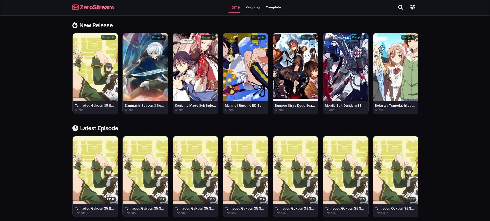
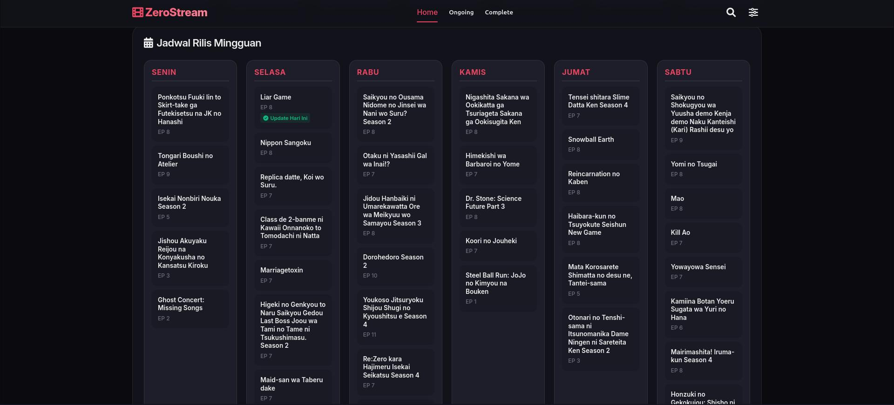
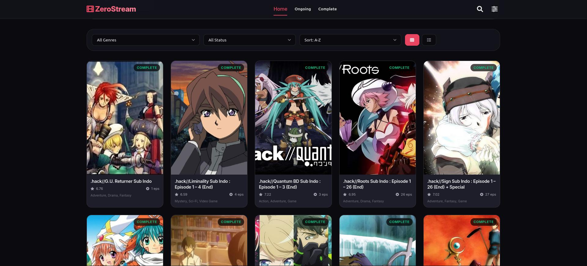
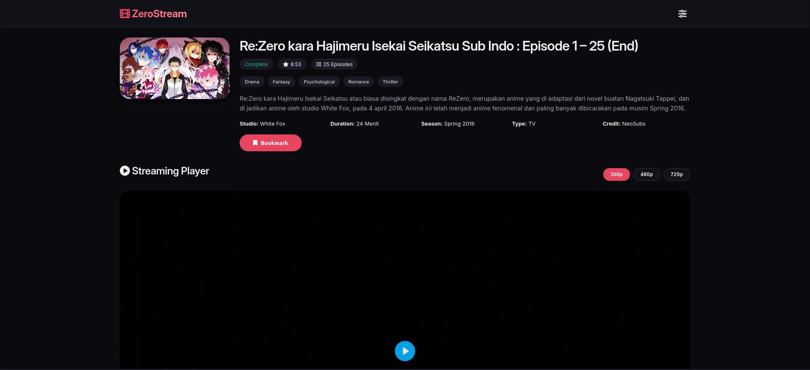

<div align="center">

```
███████╗███████╗██████╗  ██████╗ ███████╗████████╗██████╗ ███████╗ █████╗ ███╗   ███╗
╚══███╔╝██╔════╝██╔══██╗██╔═══██╗██╔════╝╚══██╔══╝██╔══██╗██╔════╝██╔══██╗████╗ ████║
  ███╔╝ █████╗  ██████╔╝██║   ██║███████╗   ██║   ██████╔╝█████╗  ███████║██╔████╔██║
 ███╔╝  ██╔══╝  ██╔══██╗██║   ██║╚════██║   ██║   ██╔══██╗██╔══╝  ██╔══██║██║╚██╔╝██║
███████╗███████╗██║  ██║╚██████╔╝███████║   ██║   ██║  ██║███████╗██║  ██║██║ ╚═╝ ██║
╚══════╝╚══════╝╚═╝  ╚═╝ ╚═════╝ ╚══════╝   ╚═╝   ╚═╝  ╚═╝╚══════╝╚═╝  ╚═╝╚═╝     ╚═╝
```

**Real-time anime streaming infrastructure — built to be fast, silent, and always on.**

[](https://nodejs.org)
[](https://sqlite.org)
[](https://github.com/websockets/ws)
[](https://expressjs.com)
[](LICENSE)

<br/>

**[🌐 English](#english) · [🇮🇩 Indonesia](#indonesia)**

</div>

---

## Preview

| Homepage | Weekly Schedule |
|:---:|:---:|
|  |  |

| Browse & Filter | Anime Detail |
|:---:|:---:|
|  |  |

---

<a name="english"></a>

## English

### What is ZeroStream?

ZeroStream is a self-hosted anime streaming platform built for performance. It runs a dual-source scraper on a cron schedule, syncs only what has actually changed using hash comparisons, and pushes updates to every connected client over WebSockets — all without external database infrastructure. Just Node.js, SQLite, and a server.

It's not a frontend-first project. The UI is clean and responsive, but the real design work is in the data pipeline: scraping reliably, writing only when necessary, and keeping clients in sync without polling.

---

### Architecture

```
Cron Scheduler
     │
     ▼
Dual-Source Scraper  ──────────────────────────────────────┐
(Primary + Fallback)                                        │
     │                                                      │
     ▼                                                      ▼
Hash Comparison ──► SQLite Database ──► REST API     WebSocket Broadcast
(skip if unchanged)   (anime, episodes,   (Express)   (real-time feed
                       feed_events)                    to all clients)
```

The scraper has two sources — a primary endpoint and a fallback homepage. If the primary is unreachable, it falls back to a local JSON cache. Database writes only happen when the hash of the incoming data differs from what's stored, so the database stays clean even under frequent scrape cycles.

---

### Features

**Backend**
- Dual-source scraper with automatic fallback to local JSON cache
- Hash-based change detection — no redundant writes to the database
- Cron-scheduled scraping with configurable intervals via `.env`
- WebSocket server that broadcasts new anime and episode events in real-time
- Express API with in-memory caching and rate limiting

**Frontend**
- Search bar with persistent state, live autocomplete dropdown, and `Esc`/clear button support
- Resolution selector with theme-adaptive contrast (360p / 480p / 720p / 1080p)
- Episode list with direct-click playback — no intermediate button
- Weekly schedule panel with per-day cards and "Update Hari Ini" indicators
- Full dark/light mode via CSS custom properties

---

### Tech Stack

| Layer | Technology |
|---|---|
| Runtime | Node.js (ES Modules), v22.13.0+ |
| API Server | Express.js |
| Database | SQLite via `node:sqlite` |
| Scraping | Axios + Cheerio |
| Real-time | `ws` (WebSockets) |
| Scheduling | Node-cron |
| Process Manager | PM2 |
| Frontend | HTML5, Vanilla JS, CSS3 |

---

### Project Structure

```
zerostream/
├── backend/
│   ├── config.js           # Environment config and constants
│   ├── database.js         # SQLite connection and query interface
│   ├── logger.js           # Winston logger
│   ├── middleware.js       # Rate limiting, caching, security headers
│   ├── migrate.js          # Table migration script
│   ├── scheduler.js        # Cron job manager
│   ├── server.js           # Express API + WebSocket server entry
│   ├── websocket.js        # Connection registry and broadcast logic
│   └── scraper/
│       └── incremental.js  # Dual-source scraper with hash diffing
│
├── frontend/
│   ├── css/
│   │   └── style.css       # Design tokens and theme variables
│   ├── js/
│   │   ├── common.js       # Global state, settings, WS event handlers
│   │   ├── detail.js       # Player logic and episode controls
│   │   └── home.js         # Schedule, search, autocomplete
│   ├── anime.html          # Detail / player page
│   └── index.html          # Homepage
│
├── data/                   # SQLite database storage
├── ecosystem.config.cjs    # PM2 config
├── package.json
└── .env
```

---

### Database Schema

| Table | Purpose | Notable Fields |
|---|---|---|
| `anime` | Core show metadata | `id`, `title`, `slug`, `synopsis`, `image_url` |
| `anime_info` | Extended details | `anime_id`, `type`, `status`, `hash_info` |
| `episodes` | Episode index + stream URLs | `id`, `anime_id`, `episode_number`, `stream_urls` |
| `feed_events` | WebSocket activity log | `id`, `event_type`, `anime_id`, `message` |

---

### Getting Started

**Prerequisites**
- Node.js v22.13.0 or higher
- npm

**1. Clone the repository**

```bash
git clone https://github.com/Ikyletwar/zerostream.git
cd zerostream
```

**2. Configure environment**

Create a `.env` file in the root:

```ini
PORT=3000
NODE_ENV=development
SCRAPE_INTERVAL_MINUTES=10
CACHE_TTL_SECONDS=60
```

**3. Install dependencies**

```bash
npm install
```

**4. Initialize the database**

```bash
npm run migrate
```

**5. Run**

```bash
# Development (with live logs)
npm run dev

# Production (requires PM2)
npm run pm2:start
```

---

### Verification

Once running, confirm everything is working:

| Check | URL | Expected |
|---|---|---|
| API health | `http://localhost:3000/api` | System status response |
| Schedule data | `http://localhost:3000/api/schedule` | Weekly schedule JSON |
| Autocomplete | Homepage search bar | Suggestions appear and persist on input |
| Playback | Any anime detail page | Clicking an episode row starts the stream |

---

<a name="indonesia"></a>

## Indonesia

### Apa itu ZeroStream?

ZeroStream adalah platform streaming anime self-hosted yang dirancang untuk performa. Platform ini menjalankan scraper dual-source secara terjadwal menggunakan cron, menyinkronkan hanya data yang benar-benar berubah melalui perbandingan hash, dan mendorong pembaruan ke setiap klien yang terhubung melalui WebSocket — semua tanpa infrastruktur database eksternal. Cukup Node.js, SQLite, dan sebuah server.

Ini bukan proyek yang berpusat pada tampilan. UI-nya bersih dan responsif, tapi pekerjaan desain sesungguhnya ada di pipeline data: scraping yang andal, penulisan hanya jika diperlukan, dan menjaga semua klien tetap sinkron tanpa polling.

---

### Arsitektur

```
Cron Scheduler
     │
     ▼
Dual-Source Scraper  ──────────────────────────────────────┐
(Primary + Fallback)                                        │
     │                                                      │
     ▼                                                      ▼
Hash Comparison ──► SQLite Database ──► REST API     WebSocket Broadcast
(skip kalau sama)    (anime, episodes,   (Express)   (real-time feed
                      feed_events)                    ke semua klien)
```

Scraper memiliki dua sumber — endpoint utama dan fallback ke homepage. Jika sumber utama tidak bisa diakses, sistem beralih ke cache JSON lokal. Penulisan ke database hanya terjadi ketika hash data baru berbeda dari yang sudah tersimpan, sehingga database tetap bersih meskipun scrape berjalan sangat sering.

---

### Fitur

**Backend**
- Scraper dual-source dengan fallback otomatis ke cache JSON lokal
- Deteksi perubahan berbasis hash — tidak ada penulisan redundan ke database
- Penjadwalan scraping via cron dengan interval yang bisa dikonfigurasi lewat `.env`
- WebSocket server yang melakukan broadcast event anime dan episode baru secara real-time
- Express API dengan in-memory caching dan rate limiting

**Frontend**
- Search bar dengan state persisten, autocomplete dropdown real-time, dan dukungan tombol `Esc` / clear
- Pemilih resolusi dengan kontras adaptif sesuai tema (360p / 480p / 720p / 1080p)
- Daftar episode dengan playback langsung satu klik — tanpa tombol perantara
- Panel jadwal mingguan dengan kartu per hari dan indikator "Update Hari Ini"
- Mode gelap/terang penuh via CSS custom properties

---

### Tech Stack

| Layer | Teknologi |
|---|---|
| Runtime | Node.js (ES Modules), v22.13.0+ |
| API Server | Express.js |
| Database | SQLite via `node:sqlite` |
| Scraping | Axios + Cheerio |
| Real-time | `ws` (WebSockets) |
| Penjadwalan | Node-cron |
| Process Manager | PM2 |
| Frontend | HTML5, Vanilla JS, CSS3 |

---

### Struktur Proyek

```
zerostream/
├── backend/
│   ├── config.js           # Konfigurasi environment dan konstanta
│   ├── database.js         # Koneksi SQLite dan query interface
│   ├── logger.js           # Winston logger
│   ├── middleware.js       # Rate limiting, caching, security headers
│   ├── migrate.js          # Skrip migrasi tabel
│   ├── scheduler.js        # Manajer cron job
│   ├── server.js           # Entry point Express API + WebSocket server
│   ├── websocket.js        # Registry koneksi dan logika broadcast
│   └── scraper/
│       └── incremental.js  # Scraper dual-source dengan hash diffing
│
├── frontend/
│   ├── css/
│   │   └── style.css       # Design token dan variabel tema
│   ├── js/
│   │   ├── common.js       # State global, settings, WS event handlers
│   │   ├── detail.js       # Logika player dan kontrol episode
│   │   └── home.js         # Jadwal, pencarian, autocomplete
│   ├── anime.html          # Halaman detail / player
│   └── index.html          # Homepage
│
├── data/                   # Penyimpanan database SQLite
├── ecosystem.config.cjs    # Konfigurasi PM2
├── package.json
└── .env
```

---

### Skema Database

| Tabel | Kegunaan | Field Penting |
|---|---|---|
| `anime` | Metadata utama per judul | `id`, `title`, `slug`, `synopsis`, `image_url` |
| `anime_info` | Detail tambahan | `anime_id`, `type`, `status`, `hash_info` |
| `episodes` | Indeks episode + stream URL | `id`, `anime_id`, `episode_number`, `stream_urls` |
| `feed_events` | Log aktivitas WebSocket | `id`, `event_type`, `anime_id`, `message` |

---

### Memulai

**Prasyarat**
- Node.js v22.13.0 atau lebih tinggi
- npm

**1. Clone repositori**

```bash
git clone https://github.com/Ikyletwar/zerostream.git
cd zerostream
```

**2. Konfigurasi environment**

Buat file `.env` di root direktori:

```ini
PORT=3000
NODE_ENV=development
SCRAPE_INTERVAL_MINUTES=10
CACHE_TTL_SECONDS=60
```

**3. Install dependensi**

```bash
npm install
```

**4. Inisialisasi database**

```bash
npm run migrate
```

**5. Jalankan**

```bash
# Development (dengan live logs)
npm run dev

# Production (membutuhkan PM2)
npm run pm2:start
```

---

### Verifikasi

Setelah berjalan, pastikan semuanya bekerja:

| Cek | URL | Yang Diharapkan |
|---|---|---|
| API health | `http://localhost:3000/api` | Response status sistem |
| Data jadwal | `http://localhost:3000/api/schedule` | JSON jadwal mingguan |
| Autocomplete | Search bar di homepage | Saran muncul dan tetap saat mengetik |
| Playback | Halaman detail anime manapun | Klik baris episode langsung memulai stream |

---

### About

ZeroStream was built by **Hizkia Letwar**, a student at SMK Negeri 1 Maluku Tengah, majoring in **TJKT (Teknik Jaringan Komputer dan Telekomunikasi)**, Class X.

No client. No deadline. No assignment brief. This project started — and finished — purely out of curiosity and a habit of building things just to see if they work. Every line of the scraper, the WebSocket layer, the hash diffing logic, the frontend — written in full vibe coding mode, late nights included.

Published: **May 2025**

---

### Tentang

ZeroStream dibuat oleh **Hizkia Letwar**, siswa SMK Negeri 1 Maluku Tengah, Jurusan **TJKT (Teknik Jaringan Komputer dan Telekomunikasi)**, Kelas X.

Tidak ada klien. Tidak ada deadline. Tidak ada tugas sekolah yang mewajibkan. Proyek ini dimulai — dan diselesaikan — murni karena hobi dan kebiasaan membangun sesuatu hanya untuk membuktikan bahwa itu bisa dibuat. Setiap baris kode di scraper, lapisan WebSocket, logika hash diffing, sampai frontend — semuanya ditulis dalam mode *full vibe coding*, termasuk begadangnya.

Dipublikasikan: **Mei 2025**

---

<div align="center">

Made with intent. Runs without noise.

*— Hizkia Letwar, Maluku Tengah*

</div>
